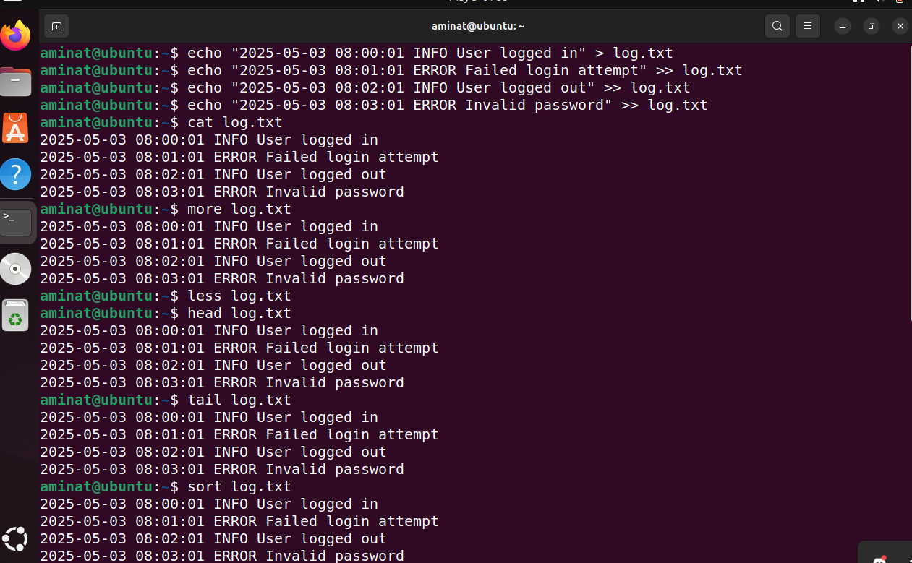
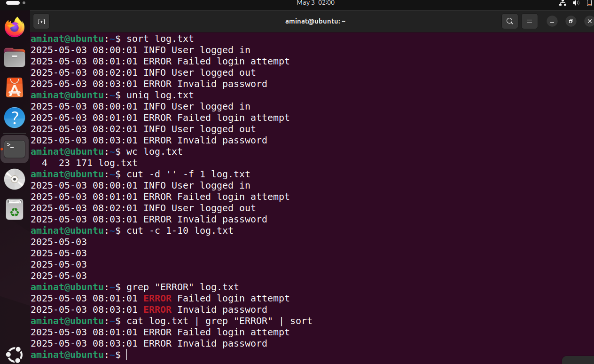

### Day 2: Manipulating Texts
## Participant Details
* Name: Aminat Animashaun
* Date: 2025-05-03
* Time: 03:20AM

## Task Details
* Practiced using cat, more, less, head, tail, cut, sort, uniq, and wc
* Used grep with multiple flags and patterns
* Redirected output using > and >>, and use pipes |
* Created a sample log file and search through it with grep

## Commands Used:

1. `cat log.txt`  
   - Output: Displays the entire content of `log.txt`.

2. `more log.txt`  
   - Output: Views `log.txt` page by page. Use space to scroll and `q` to quit.

3. `less log.txt`  
   - Output: Views `log.txt` with more control. Use arrow keys to scroll and `q` to quit.

4. `head log.txt`  
   - Output: Shows the first 10 lines of `log.txt`.

5. `tail log.txt`  
   - Output: Shows the last 10 lines of `log.txt`.

6. `cut -d ' ' -f 1 log.txt`  
   - Output: Extracts the first word (e.g., usernames) from each line in `log.txt`.

7. `sort log.txt`  
   - Output: Sorts the lines of `log.txt` alphabetically.

8. `uniq log.txt`  
   - Output: Removes duplicate adjacent lines in `log.txt`.

9. `cat log.txt | sort | uniq`  
   - Output: Sorts and removes all duplicates from `log.txt`.

10. `wc log.txt`  
    - Output: Shows the number of lines, words, and characters in `log.txt`.

11. `grep "ERROR" log.txt`  
    - Output: Shows all lines in `log.txt` containing "ERROR".

12. `grep -i "error\|warning" log.txt`  
    - Output: Case-insensitive search for both "error" and "warning".

13. `echo "Sample log entry" > newlog.txt`  
    - Output: Writes a new line to `newlog.txt`, overwriting any existing content.

14. `echo "Another entry" >> newlog.txt`  
    - Output: Appends a new line to the end of `newlog.txt`.

15. `grep "ERROR" log.txt | wc -l`  
    - Output: Counts how many error messages are in the log file.

---

## Reflection

Practicing with `cat`, `more`, `less`, `head`, `tail`, `cut`, `sort`, `uniq`, and `wc` gave me a strong foundation in viewing and processing text files.  
The combination of `grep` with multiple flags (like `-i` and `\|`) and using pipes (`|`) allowed me to search and filter log data more efficiently.  
Redirecting outputs using `>` and `>>` helped in creating and updating files without opening a text editor.  
Creating a sample log file and analyzing it with `grep` taught me how real system logs are processed and parsed on Linux.

## Command Outputs

